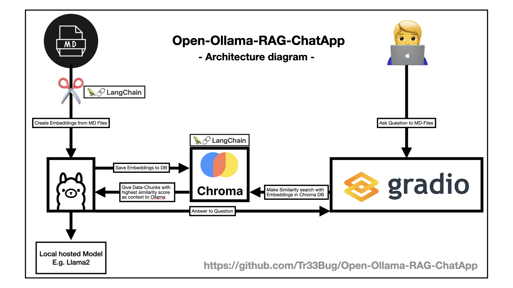

# Open-Ollama-RAG-ChatApp
Retrieval-Augmented Generation Chat Bot using Ollama, Langchain and Gradio.

## Idea
The notebook is a proof of concept on how to build a retrieval-augmented generation chatbot using Ollama, Langchain and Gradio. The chatbot is built using the following components:
- Ollama is used as backend to host large language models and provide an API to interact with them.
- Langchain is used as library to generate chunks from provided markdown files and embedd them using Ollama. The embeddings are stored in a chroma database.
- Gradio is used to provide a simple chat interface to interact with the RAG-Chatbot.



## Installation
### Prerequisites
- Ollama to host the language models.
    - Installation instructions can be found in the [Ollama Github Repository](https://github.com/ollama/ollama)
- Minicoda or other conda distribution (Optional but recommended).
    - Installation instructions can be found in the [Conda Documentation](https://docs.anaconda.com/free/miniconda/index.html)
- Poetry to install the required python packages (Optional but recommended).
    - Installation instructions can be found in the [Poetry Documentation](https://python-poetry.org/docs/)

### Steps
1. Pull the desired model for ollama and start the ollama backend using the following command:
```bash
# change model to the desired model name -> see https://ollama.com/library for other models
ollama pull llama2:chat
ollama start
```
2. Create and activate a virtual environment using conda: 
```bash
# create env
conda create -n open_rag_chat python=3.11
# activate env
conda activate open_rag_chat
```
3. Install the required packages using poetry:
```bash
poetry install
```
4. On first run set the `initial_db = True`. This will create new embeddings for the provided markdown files and create a new chroma db in the given path (`DATA_PATH = "data/"`).
5. Drop your own markdown files in the `data/` folder. 
6. Run the notebook. 

## References
- Ollama: [Ollama Github Repository](https://github.com/ollama/ollama)
- Langchain: [Langchain Documentation](https://python.langchain.com/docs/get_started/introduction)
- Gradio: [Gradio Chatinterface Documentation](https://www.gradio.app/docs/chatinterface)
- Similar Project: [Langchain RAG Tutorial by pixegami](https://github.com/pixegami/langchain-rag-tutorial)